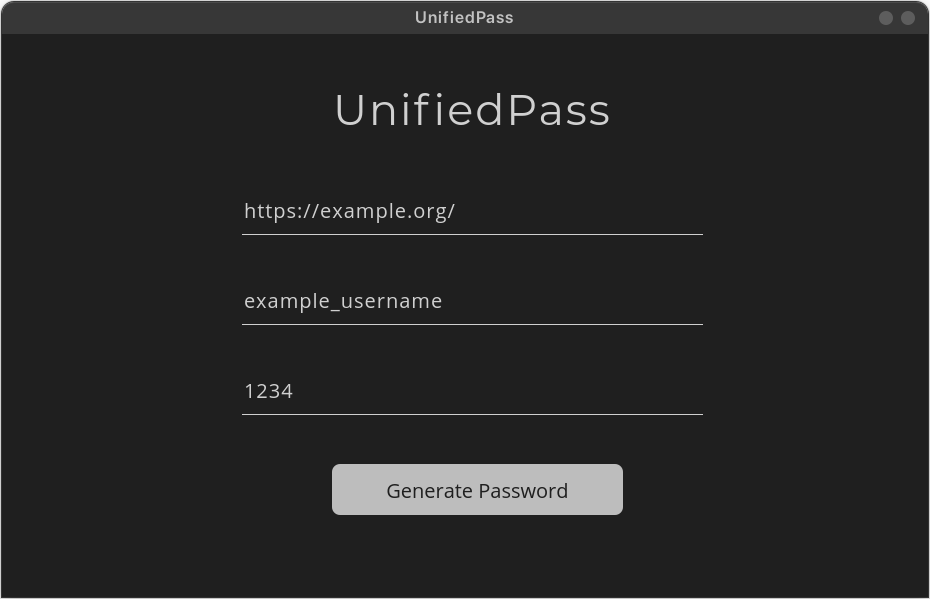

# UnifiedPass: A System Independent Credential Manager

UnifiedPass is a password manager that allows you to generate passwords without the need to store them in a database.

## :camera_flash: Screenshots

The screenshot for the login page can be found above. The application contains additional pages:

### Generate Page

Click me to expand Register Page

> Used for filling out details to generate a password.

### Password Generation

Click me to expand Password Generation

> 
On hitting the 'Generate Password' button, we can see that our password is generated.

## License

This project is available under the [Apache License 2.0](LICENSE) license.
